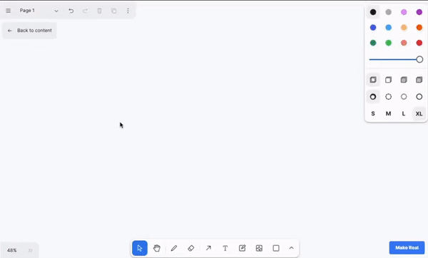

> This is an experimental fork of tldraw's [draw a ui](https://github.com/tldraw/draw-a-ui), which is an experimental fork of Sawyer Hood's [draw a ui](https://github.com/SawyerHood/draw-a-ui).

Uses Peter Salomonson's [near-bos-webcomponent](https://github.com/petersalomonsen/near-bos-webcomponent) to embed a NEAR BOS widget into a tldraw shape. Made possible by [Evgeny Kuzyakov](https://github.com/evgenykuzyakov)'s [NEARSocial/VM](https://github.com/NearSocial/VM).

Welcome to the Open Web!

Join us at [near.social](https://near.social/#/).


### Next Steps

- [ ] Merge [PR to near-bos-webcomponent](https://github.com/petersalomonsen/near-bos-webcomponent/pull/1) and replace bundles
- [ ] Ability to publish JSX widget to the [social-db](https://github.com/NearSocial/social-db)
- [ ] Load in existing widgets and make modifications to them
- [ ] Option to provide your own API key

# draw-a-ui

This is an app that uses tldraw and the gpt-4-vision api to generate JSX based on a wireframe you draw.



This works by just taking the current canvas SVG, converting it to a PNG, and sending that png to gpt-4-vision with instructions to return a single html file with tailwind.

> Disclaimer: This is a demo and is not intended for production use. It doesn't have any auth so you will go broke if you deploy it.

## Getting Started

This is a Next.js app. To get started run the following commands in the root directory of the project. You will need an OpenAI API key with access to the GPT-4 Vision API.

```bash
echo "OPENAI_API_KEY=sk-your-key" > .env.local
npm install
npm run dev
```

Open [http://localhost:3000](http://localhost:3000) with your browser to see the result.
